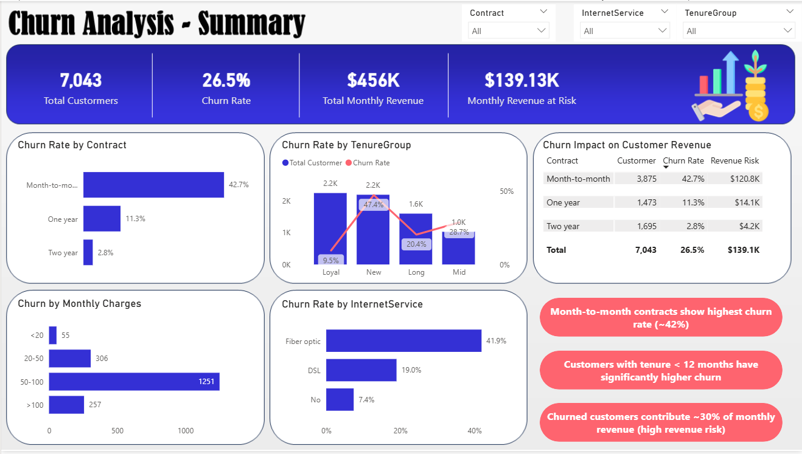
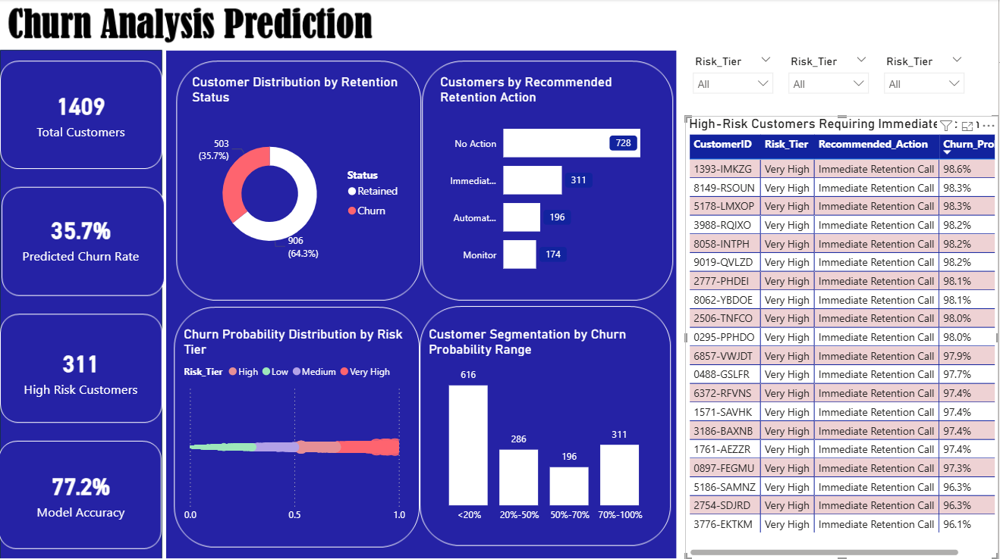

# 📊 Customer Churn Analysis & Prediction (ML + Power BI)

## 🚀 Project Overview
This project combines **data analysis and machine learning** to understand and predict customer churn.  
It includes **two Power BI dashboards**:

1. **Churn Analysis Dashboard (Descriptive)**
2. **Churn Prediction Dashboard (Machine Learning-based)**

The goal is to help businesses **identify churn patterns and take proactive retention actions**.

---

## 🎯 Objectives
- Analyze historical churn behavior
- Identify key drivers of churn
- Predict high-risk customers using ML
- Estimate revenue at risk
- Enable data-driven decision making

---

# 📊 Dashboard 1: Churn Analysis (Descriptive)

## 🔍 Purpose
Answers:
> “Why are customers churning?”

## 📌 Features
- Churn rate by contract, tenure, and services
- Customer segmentation analysis
- Revenue impact of churn
- Key churn drivers

## 🖼 Dashboard Preview


---

# 🤖 Dashboard 2: Churn Prediction (ML-Based)

## 🔍 Purpose
Answers:
> “Which customers are likely to churn?”

## 📌 Features
- Predicted churn rate
- Risk tier segmentation (Low / Medium / High)
- High-risk customers list
- Recommended retention actions
- Churn probability distribution

## 🖼 Dashboard Preview


---

# 🧠 Machine Learning Model

- Model: **XGBoost Classifier**
- Techniques:
  - Feature Engineering (tenure, spending behavior, service usage)
  - Class imbalance handling
  - Threshold optimization (Precision-Recall tradeoff)

## 📊 Model Performance
- Accuracy: ~77%
- Recall (Churn): ~74–79%
- Focus: **Maximizing churn detection**

---

# 📁 Project Structure
data/ → datasets
notebooks/ → ML model code
powerbi/ → Power BI dashboards
models/ → trained model
images/ → dashboard screenshots

---

# ⚙️ How to Run

```bash
pip install -r requirements.txt
python FinalPrediction.ipynb
```

## 📌 Key Insights

### From Analysis Dashboard:
- Month-to-month contracts have highest churn  
- Fiber optic users show higher churn behavior  
- New customers churn more frequently  

### From Prediction Dashboard:
- High-risk customers identified using probability scoring  
- Revenue at risk concentrated in specific segments  
- ML enables proactive retention strategy

## 🛠 Tools & Technologies

- Python (Pandas, NumPy, Scikit-learn, XGBoost)
- Power BI (Data Visualization)
- SQL (Data Preparation)

  
## 💡 Business Impact

### This project helps businesses:

- Identify customers likely to churn
- Reduce revenue loss
- Prioritize retention campaigns
- Make data-driven decisions

## 👤 Author

### Adnan Bin Abdul Khaleque
